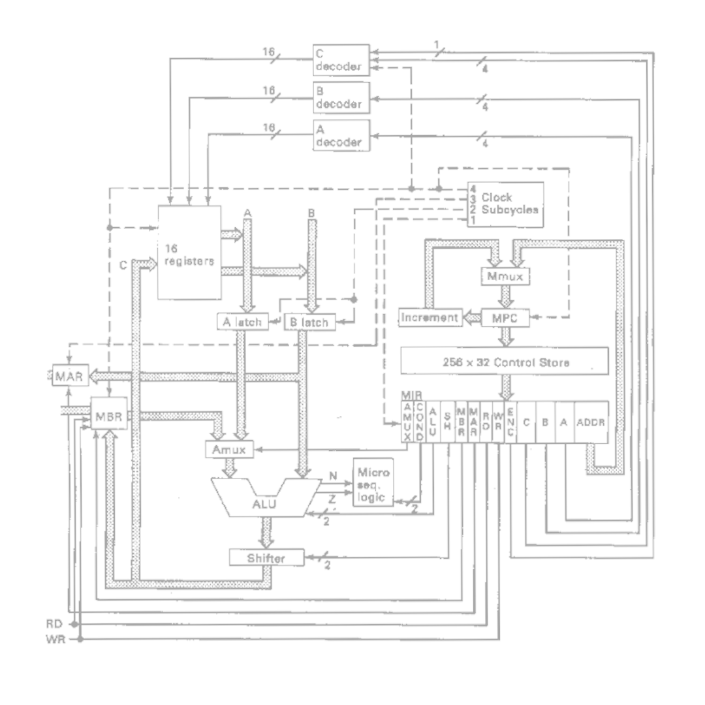

# Simulador MIC-1

Trabalho realizado durante o curso da disciplina de Arquiteturas de Computadores (TCC00286), lecionada pelo professor Eugene Vinod no segundo semestre de 2024 - Universidade Federal Fluminense (UFF)

---

Baseado na microarquitetura **MIC-1** proposta por Andrew S. Tanenbaum em seu livro *Structured Computer Organization*

Alguns exemplos de microprogramas estão disponíveis no repositório. Ao carregar um microprograma na memória de controle, não se esqueça de pressionar o botão confirma (nuvem) depois de enviar o arquivo `.mic1`. 

O carregamento da memória de controle será confirmado com uma caixa de texto exibindo as microinstruções em binário.